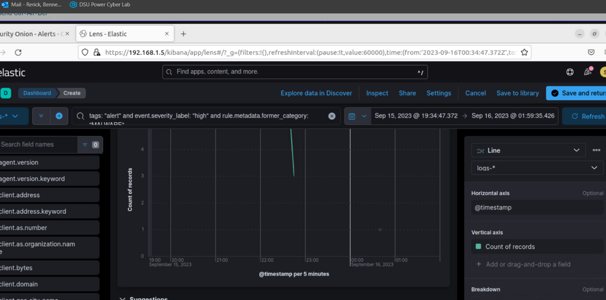

# Kibana Incident Response Dashboards

## Overview
This project demonstrates the use of **Kibana dashboards** to analyze malware activity captured in network traffic. Multiple visualizations were created to support incident response workflows.

## Visualizations
- **Time-series graph**: Malware alerts over time
- **Table**: Top malware family names and frequency
- **Suspicious domains table**: Queried domains, source IPs, and counts
- **Proportion chart**: Strange/obfuscated URIs observed in HTTP traffic
- **Custom visualization**: Extra network behavior of interest

## Tools & Technologies
- Kibana (Elastic Stack)
- PCAP analysis (imported logs)
- Elasticsearch queries

## Time-Series Graph of Malware Alerts

This line graph shows the count of malware alerts over time, based on events from the packet capture.  
It highlights the activity trends of the three malware families identified in the dataset.  
Tracking alerts over time makes it easier to spot **attacks, peaks in activity, or periods of dormancy**.  

