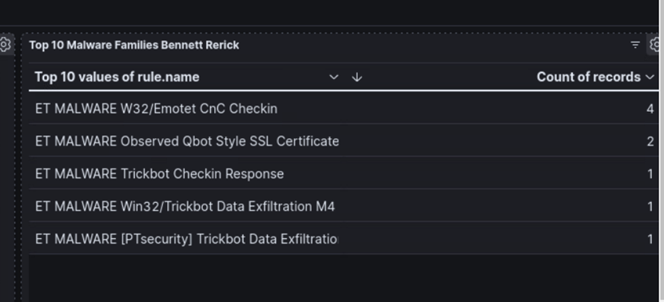
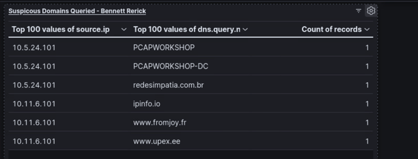

# Kibana Incident Response Dashboards

## Overview
This project demonstrates the use of **Kibana dashboards** to analyze malware activity captured in network traffic. Multiple visualizations were created to support incident response workflows.

## Visualizations
- **Time-series graph**: Malware alerts over time
- **Table**: Top malware family names and frequency
- **Suspicious domains table**: Queried domains, source IPs, and counts
- **Proportion chart**: Strange/obfuscated URIs observed in HTTP traffic
- **Custom visualization**: Extra network behavior of interest

## Tools & Technologies
- Kibana (Elastic Stack)
- PCAP analysis (imported logs)
- Elasticsearch queries

## Time-Series Graph of Malware Alerts

This line graph shows the count of malware alerts over time, based on events from the packet capture.  
It highlights the activity trends of the three malware families identified in the dataset.  
Tracking alerts over time makes it easier to spot **attacks, peaks in activity, or periods of dormancy**.  

## Malware Family Count Table

This table lists the malware family names and the frequency of each observed in the packet capture.  
It provides a quick way to measure **which malware families were most active** and prioritize response efforts.  

## Suspicious Domains Table

This visualization shows suspicious domains queried by infected hosts, along with the **source IP address** and the **number of times** each domain was requested.  
By correlating source IPs to suspicious domains, analysts can identify **which systems are compromised** and communicating with malicious infrastructure.  

## Weird URI Proportion Chart

This proportion (donut) chart displays the distribution of unusual or “weird” URIs observed in HTTP traffic.  
These URIs often contain **random strings, strange file extensions, or hostnames** that do not belong in normal traffic.  
The visualization makes it easy to spot **potentially malicious requests** and focus on the most abnormal behavior.  

